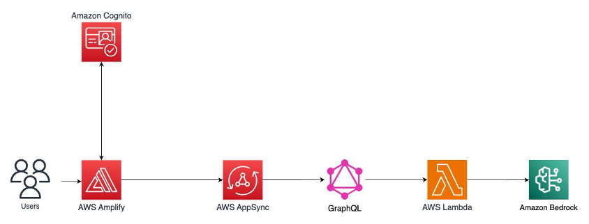

# Serverless Web Application using Generative AI 
"AI Recipe Generator"


## AWS Amplify and Amazon Bedrock Application

### Understanding the Core Components:

let's break down the key components of the application:

#### Frontend:

- User Interface: An HTML-based web interface allows users to input a list of ingredients.
- Amplify Hosting: This service deploys and hosts the static frontend application.

#### Backend:

- Amplify API: A GraphQL API built with AppSync to handle requests from the frontend.
- AWS Lambda: Serverless functions triggered by API requests to process ingredient data and generate recipes.
- Amazon Bedrock: A foundational AI service that provides access to large language models, including Claude 3 Sonnet.

#### Data Flow:

- The user enters ingredients into the frontend.
- The frontend sends a GraphQL request to the Amplify API.
- The API triggers a Lambda function.
- The Lambda function sends a request to Amazon Bedrock with the ingredient list.
- Amazon Bedrock processes the request and generates a list of recipes.
- The Lambda function returns the recipes to the API.
- The API sends the recipes back to the frontend.
- The frontend displays the generated recipes to the user.

#### Visualizing the Architecture:



### React + TypeScript + Vite

This template provides a minimal setup to get React working in Vite with HMR and some ESLint rules.

Currently, two official plugins are available:

- [@vitejs/plugin-react](https://github.com/vitejs/vite-plugin-react/blob/main/packages/plugin-react/README.md) uses [Babel](https://babeljs.io/) for Fast Refresh
- [@vitejs/plugin-react-swc](https://github.com/vitejs/vite-plugin-react-swc) uses [SWC](https://swc.rs/) for Fast Refresh

## Expanding the ESLint configuration

If you are developing a production application, we recommend updating the configuration to enable type aware lint rules:

- Configure the top-level `parserOptions` property like this:

```js
export default tseslint.config({
  languageOptions: {
    // other options...
    parserOptions: {
      project: ['./tsconfig.node.json', './tsconfig.app.json'],
      tsconfigRootDir: import.meta.dirname,
    },
  },
})
```

- Replace `tseslint.configs.recommended` to `tseslint.configs.recommendedTypeChecked` or `tseslint.configs.strictTypeChecked`
- Optionally add `...tseslint.configs.stylisticTypeChecked`
- Install [eslint-plugin-react](https://github.com/jsx-eslint/eslint-plugin-react) and update the config:

```js
// eslint.config.js
import react from 'eslint-plugin-react'

export default tseslint.config({
  // Set the react version
  settings: { react: { version: '18.3' } },
  plugins: {
    // Add the react plugin
    react,
  },
  rules: {
    // other rules...
    // Enable its recommended rules
    ...react.configs.recommended.rules,
    ...react.configs['jsx-runtime'].rules,
  },
})
```
